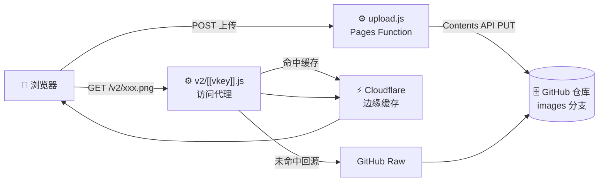
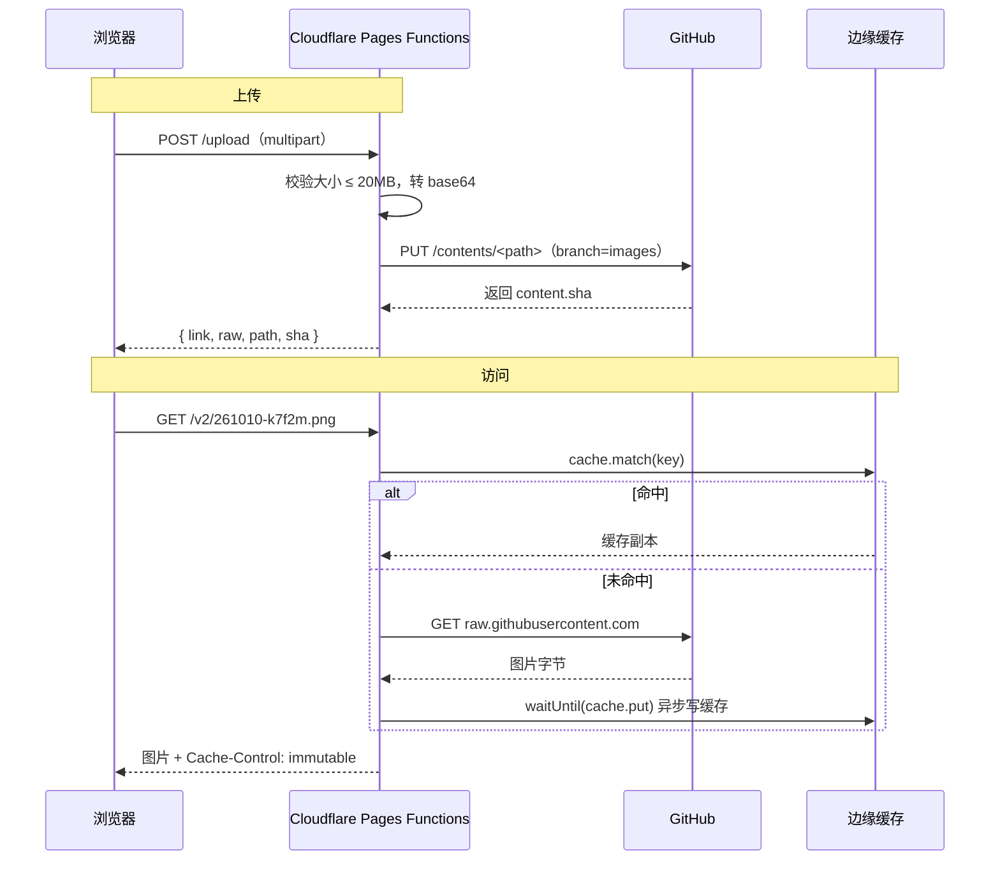
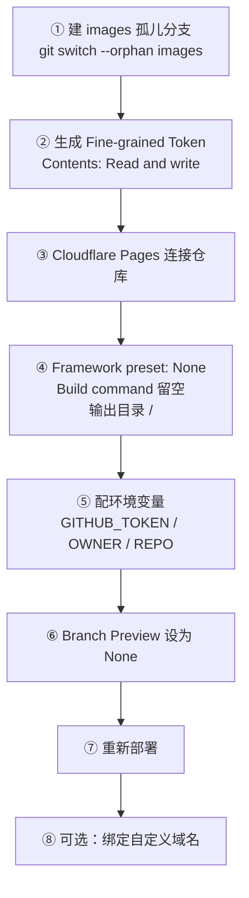
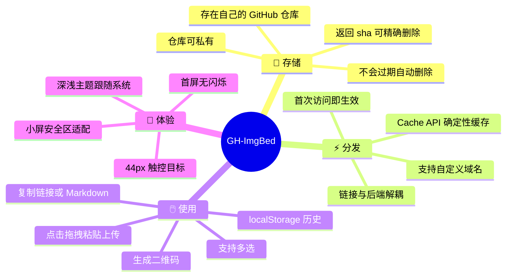

一个零服务器成本的免费图床：**图片存进你自己的 GitHub 仓库**，通过 Cloudflare 边缘节点缓存分发。

前端是纯静态页面，后端只有两个 Cloudflare Pages Functions。没有数据库、没有自建服务器、没有构建步骤。

:::tip[为什么不用现成图床]
第三方图床要么有「X 个月未访问自动删除」，要么哪天就关停了。图片存在自己仓库里，数据在自己手上，链接也不会因为服务跑路而失效。
:::

---

## 🏗️ 整体架构

浏览器从头到尾只跟 Cloudflare 边缘节点通信，回源由服务端完成。



**关键点**：访客所在网络能否直连 GitHub，并不影响访问 —— 回源这一步发生在服务端。

---

## 🔄 上传与访问时序



文件名格式是 `YYMMDD-5位随机.扩展名`，例如 `261010-k7f2m.png`。5 位随机空间约 6000 万，撞名概率极低，代码里仍保留了最多 6 次的换名重试。

---

## 🚀 部署流程



---

## ✨ 功能特性



---

## ⚙️ 环境变量

| 变量名 | 说明 | 必填 |
| :-- | :-- | :--: |
| `GITHUB_TOKEN` | Fine-grained 令牌，仅对存图仓库开放 Contents 读写 | ✅ |
| `GITHUB_OWNER` | 存图仓库的所有者用户名 | ✅ |
| `GITHUB_REPO` | 存图仓库名 | ✅ |
| `GITHUB_PATH` | 仓库内子目录，留空则存根目录（链接更短） | 可选 |
| `IMG_CDN` | 设为 `jsdelivr` 可改走 jsDelivr 回源 | 可选 |

:::caution[两个容易踩的坑]
**1. 分支名固定为 `images`，不能自定义。**

访问代理不校验路径，如果图片与代码同分支，代码文件可能被构造路径读到。固定孤儿分支是安全隔离的前提。

**2. 务必把 Branch Preview 设为 None。**

否则每次上传图片推送到 `images` 分支都会触发一次构建，很快耗尽每月 500 次的免费额度。

改完环境变量需要**重新部署**才生效。
:::

---

## 📁 目录结构

```text
index.html                  页面结构
assets/app.css              样式：设计令牌、深浅主题、响应式
assets/app.js               逻辑：上传、列表、复制、二维码、主题
assets/fonts.css            Material Icons 字体声明（本地）
assets/fonts/*.woff2        Material Icons 字体文件
functions/upload.js         上传：写入 GitHub
functions/v2/[[vkey]].js   访问：回源 + 边缘缓存
scripts/verify_upload.py    部署前自检脚本
```

图标字体是本地自托管的，**不引用 fonts.googleapis.com**（该域名在中国大陆不可访问）。字体名须与 mdui 期望的完全一致，且需开启 `font-feature-settings: 'liga'`，否则连字不生效、图标会显示为文字。

---

## ✅ 部署前自检

```bash
export GITHUB_TOKEN='github_pat_xxx'
export GITHUB_OWNER='你的用户名'
export GITHUB_REPO='你的仓库'
python3 scripts/verify_upload.py
```

脚本会依次检查令牌有效性、仓库可访问性、写入权限、链接可访问性，并自动清理测试文件。

---

## ⚠️ 已知限制

| 限制 | 说明 |
| :-- | :-- |
| 单文件 20MB | 代码中已做校验 |
| 访问路径未做白名单 | 依赖 `images` 孤儿分支隔离，不要往该分支放非图片文件 |
| GitHub API 限额 | 5000 次/小时，个人图床足够 |
| Cloudflare 免费额度 | 请求 10 万/天，构建 500 次/月 |
| 仓库体积 | 建议控制在 1GB 以内 |
| 国内访问 | Cloudflare 在中国大陆无边缘节点，访客可能被路由到境外。可设 `IMG_CDN=jsdelivr` 改走 jsDelivr 回源 |

---

## 🛠️ 技术栈

| 部分 | 说明 |
| :-- | :-- |
| 页面 | 原生 HTML + JavaScript，无框架、无构建 |
| 组件 | [mdui 2](https://www.mdui.org/)（Web Components，CDN 引入） |
| 图标 | Material Icons 字体（本地自托管） |
| 二维码 | qrcode（CDN，按需动态加载） |
| 后端 | Cloudflare Pages Functions |

---

## 📄 许可

MIT License — 可自由使用、修改和分发

---

::github{repo="xingmihai/gh-imgbed"}
