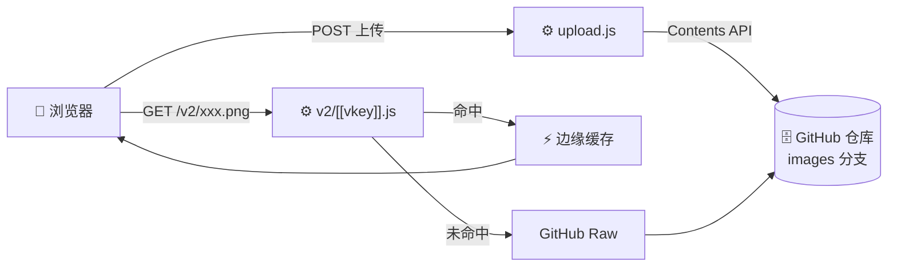

一个零服务器成本的免费图床：**图片存进你自己的 GitHub 仓库**，通过 Cloudflare 边缘节点缓存分发。

前端是纯静态页面，后端只有两个 Cloudflare Pages Functions。没有数据库、没有自建服务器、没有构建步骤。

## 工作原理

浏览器从头到尾只跟 Cloudflare 边缘节点通信，回源由服务端完成：



访客所在网络能否直连 GitHub，并不影响访问 —— 回源这一步发生在服务端。

## 为什么不用现成图床

第三方图床要么有「X 个月未访问自动删除」，要么哪天就关停了。图片存在自己仓库里，数据在自己手上，链接也不会因为服务跑路而失效。

## 特性

- **数据自主** — 图片存在自己的 GitHub 仓库，不依赖任何第三方图床服务
- **不会过期** — 没有「X 个月未访问自动删除」的策略
- **可以删除** — 上传响应返回 `sha`，可精确删除单个文件
- **仓库可私有** — 访问代理携带令牌回源，代码无需开源
- **边缘缓存** — Cloudflare Cache API 确定性缓存，首次访问即生效
- **链接与后端解耦** — 访问统一走 `/v2/` 代理，日后换存储或 CDN，老链接不用改
- **免域名** — 可用 `*.pages.dev`，也支持绑定自己的域名

## 使用体验

- 点击 / 拖拽 / **粘贴**上传，支持多选
- 每条结果可：复制链接、复制 Markdown、查看二维码、打开原图、移除
- 一键复制全部链接或全部 Markdown
- 上传历史存 localStorage，刷新后仍在
- 深浅主题切换（未选择时跟随系统，首屏无闪烁）
- 小屏适配：安全区、44px 触控目标、响应式布局

## 快速开始

### 1. 准备存图位置

图片写入仓库的 **`images` 分支**，建议写成孤儿分支，与代码历史完全隔离：

```bash
git switch --orphan images
git rm -rf .
echo "# 图库" > README.md
git add README.md
git commit -m "init: 图片存储分支"
git push -u origin images
```

:::caution[分支名固定为 images]
访问代理不校验路径，若图片与代码同分支，代码文件可能被构造路径读到。固定孤儿分支是安全隔离的前提。
:::

### 2. 创建专用令牌

生成 **Fine-grained personal access token**：

- Repository access → 只选存图用的那个仓库
- Permissions → **Contents: Read and write**

只给这一个仓库、只给这一项权限，即便泄露损失也仅限于该仓库。

### 3. 配置环境变量并部署

| 变量名 | 说明 | 必填 |
|---|---|:--:|
| `GITHUB_TOKEN` | 上一步的令牌 | ✅ |
| `GITHUB_OWNER` | 存图仓库的所有者用户名 | ✅ |
| `GITHUB_REPO` | 存图仓库名 | ✅ |
| `GITHUB_PATH` | 仓库内子目录，留空则存根目录 | 可选 |

Pages 构建设置：Framework preset 选 **None**，Build command 留空，输出目录 `/`。

:::caution[务必关闭 Branch Preview]
把 **Branch Preview 设为 None**（或只勾 `main`），否则每次上传图片推送到 `images` 分支都会触发构建，很快耗尽每月 500 次的免费额度。
:::

## 部署前自检

```bash
export GITHUB_TOKEN='github_pat_xxx'
export GITHUB_OWNER='你的用户名'
export GITHUB_REPO='你的仓库'
python3 scripts/verify_upload.py
```

脚本会依次检查令牌有效性、仓库可访问性、写入权限、链接可访问性，并自动清理测试文件。

## 已知限制

| 限制 | 说明 |
|---|---|
| 单文件 20MB | 代码中已做校验 |
| 访问路径未做白名单 | 依赖 `images` 孤儿分支隔离 |
| GitHub API 限额 | 5000 次/小时，个人图床足够 |
| Cloudflare 免费额度 | 请求 10 万/天，构建 500 次/月 |
| 仓库体积 | 建议控制在 1GB 以内 |
| 国内访问 | 可设 `IMG_CDN=jsdelivr` 改走 jsDelivr 回源 |

## 技术栈

| 部分 | 说明 |
|---|---|
| 页面 | 原生 HTML + JavaScript，无框架、无构建 |
| 组件 | [mdui 2](https://www.mdui.org/)（Web Components） |
| 图标 | Material Icons 字体（本地自托管） |
| 后端 | Cloudflare Pages Functions |

## 许可

MIT License — 可自由使用、修改和分发
